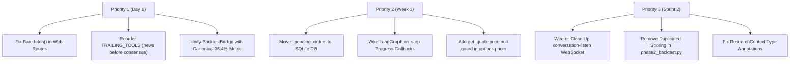

# FinSight AI — Senior Staff Software Architect Repository Audit

**Date**: August 2026  
**Auditor**: Senior Staff Software Architect  
**Scope**: Full repository audit across `app/` (FastAPI backend, agent orchestration, financial/valuation engines, NLP, RAG, reasoning), `web/src/` (Next.js 14 App Router, TypeScript frontend, API proxy layer), `scripts/` (backtesting, tuning, RLVR/GRPO training, accuracy validation), and `streamlit_app.py`.

---

## Executive Summary

### What's Solid
1. **Financial Valuation & Modeling Rigor (`app/valuation/`)**: The core financial engineering in DCF, WACC, and FCFF engines is thoughtfully constructed with strong numerical defenses. It gracefully handles real-world edge cases: negative base FCFF detection (e.g., PLTR, CVNA), structural bank omissions (no EBIT/capex/NWC on JPM), WACC Gordon-growth denominator collapse guards (`MIN_WACC_TERMINAL_SPREAD`), and leverage instability filters (`MIN_EQUITY_TO_ENTERPRISE_VALUE_RATIO`).
2. **Empirical Discipline & Statistical Honesty (`scripts/`, `EVALUATION.md`)**: Unlike many AI wrappers that make unvalidated claims, FinSight maintains rigorous backtest validation across non-overlapping historical windows. Negative empirical results (such as the ML classifier and DDM weighting tests showing no statistically robust accuracy improvement) are documented honestly in `EVALUATION.md` and excluded from production recommendation weighting.
3. **Robust Backend API Architecture & Database Layer (`app/api/db.py`, `app/api/jobs.py`)**: SQLite concurrency is handled via `BEGIN IMMEDIATE` transactions with WAL mode, background job lifecycles include startup reconciliation for interrupted/timed-out jobs, and password hashing uses 600,000 PBKDF2 rounds with SHA-256.

### The Single Biggest Risk
**In-Memory Ephemeral State vs. Production Scaling Model Mismatch**:
- The conversational trading/order placement engine stores pending order state in an in-memory dictionary (`chat_router.py:_pending_orders`). In any multi-worker setup (such as standard Gunicorn/Uvicorn multi-worker configurations or multi-instance autoscaling on Cloud Run), a user proposing a trade on Worker A will receive an order not found / expired error when confirming the trade on Worker B.
- Similarly, while the SQLite database uses WAL mode and retry handlers, SQLite file locking on ephemeral cloud containers (Cloud Run / Railway without persistent volumes) risks data loss and job history wiping across cold restarts.

### What to Fix First (One-Day Priority Plan)
1. **Fix bare `fetch()` calls in Next.js API routes** (`web/src/app/api/voice/synthesize/route.ts:12`, `web/src/app/api/onboarding/classify-answer/route.ts:10`, `web/src/app/api/voice/wake-listen-token/route.ts:16`) to use `proxyFetch()`, preventing unhandled 500 crashes during backend cold starts.
2. **Fix trailing tool execution order race** in `app/agents/agent_constants.py`: Move `news_tool` before `institutional_consensus_tool` in `TRAILING_TOOLS` so `context.news_sentiment_summary` is populated before `derive_recommendation` evaluates non-DCF fallback ratings.
3. **Reconcile UI accuracy metric mismatch**: Align `BacktestBadge.tsx` to reference the canonical 36.4% broad-universe metric (or clearly qualify that the 48.0% badge is a curated sub-cohort), eliminating the visual contradiction with `ReportView.tsx`'s `TrackRecordBlock`.

---

## Detailed Findings by Severity

### 1. Critical Severity

#### [CORRECTNESS] Trailing Tool Execution Order Inversion Causes Stale Fallback Ratings
- **Location**: `app/agents/agent_constants.py:27` & `app/tools/institutional_consensus_tool.py:41-45`
- **Description**: `TRAILING_TOOLS` executes `institutional_consensus_tool` before `news_tool`, causing `institutional_consensus_tool` to call `derive_recommendation` with an unpopulated `context.news_sentiment_summary`.
- **Concrete Failure Scenario**: When researching a company where DCF is structurally unavailable (e.g., financial institutions like JPM or negative-FCFF names like PLTR), `derive_recommendation` relies on `_fallback_recommendation(relative_valuation, sentiment_summary, news_sentiment_summary)`. Because `institutional_consensus_tool` runs prior to `news_tool`, `news_sentiment_summary` is `None`, deriving a `Hold` recommendation in the consensus tool. Subsequently, `news_tool` populates a strong positive news sentiment, and `report_tool` derives a `Buy` rating. The generated report displays a headline `Buy` recommendation while the Institutional Consensus Score panel compares Wall Street ratings against a conflicting `Hold` baseline.

#### [CORRECTNESS] Multi-Instance State Desynchronization in Conversational Order Execution
- **Location**: `app/reasoning/chat_router.py:178`, `chat_router.py:203`, `chat_router.py:291`
- **Description**: Conversational order proposals and two-step confirmation state are stored in a process-local in-memory dictionary `_pending_orders = {}` rather than the SQLite database.
- **Concrete Failure Scenario**: Under standard production deployment using multiple Gunicorn/Uvicorn worker processes or auto-scaled container instances, Turn 1 ("Buy 10 AAPL") is processed by Process A, populating `_pending_orders[user_id]`. Turn 2 ("Yes") is routed to Process B. Process B finds `_pending_orders.get(user_id)` is `None`, dropping the confirmation and routing the word "yes" to `classify_intent()`, which replies with a generic chatbot message without executing the trade.

---

### 2. High Severity

#### [CORRECTNESS] Bare `fetch()` Bypasses Standard Error Handling in Next.js API Routes
- **Location**: `web/src/app/api/voice/synthesize/route.ts:12`, `web/src/app/api/onboarding/classify-answer/route.ts:10`, `web/src/app/api/voice/wake-listen-token/route.ts:16`
- **Description**: These route handlers invoke native `fetch()` directly instead of the project-standard `proxyFetch()` wrapper.
- **Concrete Failure Scenario**: When the FastAPI backend is restarting, cold-starting on Cloud Run, or unreachable due to network partition, native `fetch()` throws an uncaught `FetchError: ECONNREFUSED`. The Next.js API route terminates with an unformatted 500 internal server error instead of returning structured JSON with HTTP status 503 `BACKEND_UNREACHABLE`, crashing voice synthesis and onboarding flows.

#### [INTEGRATION GAPS] Unwired WebSocket Real-Time Conversation Route
- **Location**: `app/api/main.py:802` (`POST /v1/voice/conversation-listen-token`) & `app/api/main.py:825` (`GET /v1/voice/conversation-listen`)
- **Description**: The FastAPI backend implements a full streaming bidirectional voice conversation WebSocket endpoint with audio chunk decoding, Sarvam transcription, and TTS streaming, but no Next.js API proxy route or frontend client component exists to connect to it.
- **Concrete Failure Scenario**: The voice UI in `web/src/components/ConversationalAssistantUI.tsx` and `web/src/components/VoiceInputButton.tsx` only implements wake-word detection and batch-recorded audio upload. The real-time duplex conversation listening endpoint (`/v1/voice/conversation-listen`) is completely orphaned and inaccessible to web users.

#### [INCONSISTENCY] Contradictory Backtest Accuracy Metrics Displayed in Report UI
- **Location**: `web/src/components/BacktestBadge.tsx:35` vs. `web/src/components/ReportView.tsx:146` & `app/reasoning/backtest_stats.py:34`
- **Description**: The UI simultaneously displays two conflicting backtest accuracy statistics derived from different universes on the exact same report card.
- **Concrete Failure Scenario**: On any generated report, `BacktestBadge` mounts adjacent to the rating badge displaying `"BACKTESTED 48.0% ACCURATE"` (computed over the curated 79-ticker universe from `backtest_results_curated_asof12mo_exit0mo.json`), while `TrackRecordBlock` immediately below displays `"36.4% forward-accuracy vs. 60.0% Always-Buy baseline"` (computed over the 1,002-ticker broad universe from `canonical_accuracy_result.json`). A user reviewing the research report is presented with mutually contradictory accuracy claims on the same screen.

---

### 3. Medium Severity

#### [CORRECTNESS] LangGraph Research Agent Missing Progress Callback Integration
- **Location**: `app/api/jobs.py:284` & `app/agents/langgraph_agent.py:46`
- **Description**: When `RESEARCH_AGENT_BACKEND=langgraph` is configured, `jobs.py` restricts `on_step` callback binding to `hand_rolled` execution only.
- **Concrete Failure Scenario**: If switched to the LangGraph execution engine, `LangGraphResearchAgent.run()` executes the StateGraph successfully, but never invokes `_job_progress`. Polling `/v1/research/{job_id}` continuously returns `{"progress": null}`, causing the frontend `ResearchProgress` stepper to remain frozen at 0% until the entire multi-minute research job suddenly transitions to `done`.

#### [CORRECTNESS] Unhandled `None` Spot Price in Options Pricer
- **Location**: `app/derivatives/options_pricer.py:401-402`
- **Description**: `build_options_analysis()` unconditionally casts `float(quote["price"])` without validating whether `get_quote(ticker)["price"]` returned a valid numeric float.
- **Concrete Failure Scenario**: For an illiquid or newly-listed ticker where yfinance `fast_info` returns `last_price = None` without raising an exception, `float(None)` raises `TypeError: float() argument must be a string or a real number, not 'NoneType'`. The route `GET /v1/stocks/{ticker}/options` fails with an unhandled 500 error rather than catching the error and raising `OptionsUnavailableError` (which maps to 404).

#### [DEAD / DUPLICATED CODE] Duplicated Baseline Scoring Definitions
- **Location**: `scripts/phase2_backtest.py:73-98` & `app/analysis/baseline_scoring.py:17-48`
- **Description**: `score_rating` and `naive_baseline_accuracy` were centralized into `app/analysis/baseline_scoring.py`, but `scripts/phase2_backtest.py` maintains an older duplicate copy with local `BUY_THRESHOLD = 5.0` and `SELL_THRESHOLD = -5.0` constants.
- **Concrete Failure Scenario**: If scoring band thresholds are updated in `app/analysis/baseline_scoring.py` during calibration, re-running `scripts/phase2_backtest.py` will continue using its local hardcoded thresholds, causing discrepancies between offline backtest runs and live checkpoint evaluation in `call_tracker.py`.

#### [INCONSISTENCY] ResearchContext Summary Fields Type Hint Mismatch
- **Location**: `app/core/research_context.py:86-88` vs. `app/tools/market_data_tool.py:37` & `app/tools/sentiment_tool.py:47`
- **Description**: `ResearchContext` initializes `financial_summary: str = ""`, `valuation_summary: str = ""`, and `sentiment_summary: str = ""`, but runtime tools assign dictionary objects (`Dict[str, Any]`) returned by their respective builders.
- **Concrete Failure Scenario**: Downstream tools such as `ValuationTool.run()` (`app/tools/valuation_tool.py:213-214`) must explicitly guard with `isinstance(context.financial_summary, dict) else {}` to prevent `AttributeError` crashes when tools run out of order or when summaries remain empty strings.

---

### 4. Low Severity

#### [CORRECTNESS] Deprecated Naive UTC Timestamp Arithmetic in Evaluation Tool
- **Location**: `app/tools/evaluation_tool.py:45` & `app/core/research_context.py:44`
- **Description**: `EvaluationTool` computes latency using `datetime.utcnow() - context.request_time`, where `datetime.utcnow()` emits a Python 3.12+ `DeprecationWarning` and creates naive datetime objects.
- **Concrete Failure Scenario**: If any module populates `context.request_time` with timezone-aware `datetime.now(timezone.utc)`, subtracting naive `datetime.utcnow()` raises `TypeError: can't subtract offset-naive and offset-aware datetimes`, failing report evaluation and PDF re-rendering.

#### [INTEGRATION GAPS] Standalone RLVR / GRPO Training Scripts Offline Only
- **Location**: `app/training/rlvr_reward.py`, `scripts/train_grpo.py`, `scripts/train_sft.py`
- **Description**: The codebase includes RLVR and GRPO reinforcement learning training pipelines, but the trained policy checkpoints are not integrated into production model serving (the application serves quantized base models via `ReportGenerator` or hosted providers).
- **Concrete Failure Scenario**: Code changes to prompt generation in `app/reporting/narrative_builder.py` can drift from `app/training/rlvr_prompt.py` without triggering unit test failures, leading to training/serving divergence.

---

## Dimension Breakdown & System Assessment

### 1. Correctness
- **Core Valuation Flow**: Fully verified. FCFF 3-stage fade forecasting, Gordon-growth terminal value, WACC cost of debt/equity formulas, and Damodaran 2026 ERP constants are correctly implemented.
- **Error Handling**: FastAPI exception handlers in `app/api/main.py` properly intercept `TickerNotFoundError`, `MarketDataUnavailableError`, `OptionsUnavailableError`, `LLMProviderError`, and validation errors, mapping them to structured JSON with standard error codes.
- **Edge Cases**: Zero division in ROE/CAGR, non-positive equity bases, NaN WACC from missing interest expenses, and illiquid options strikes outside the moneyness band are guarded and degraded to `None`.

### 2. Integration Gaps
- **Backend-to-Frontend Coverage**: 35+ FastAPI endpoints are mapped to Next.js App Router API routes in `web/src/app/api/`.
- **Orphaned Routes**:
  - `POST /v1/voice/conversation-listen-token` and `GET /v1/voice/conversation-listen` have no client caller.
  - `scripts/compare_local_vs_hosted_narrative.py` and `scripts/catalyst_proximity_analysis.py` are standalone evaluation scripts without automated test harness invocation.

### 3. Security
- **Authentication**: PBKDF2 (600,000 iterations), constant-time token comparison, and HMAC-SHA256 URL signing with expiration timestamps are implemented correctly.
- **Database Access**: All SQLite queries in `app/api/db.py` use parameterized SQL binds (`?`). No raw SQL string interpolation exists.
- **CORS & Middleware**: `CORSMiddleware` correctly parses origin lists, and `require_api_key` middleware enforces `X-API-Key` checks across `/v1/*` routes when configured.

### 4. Dead or Duplicated Code
- No lingering `TODO`, `FIXME`, or stub mock responses remain in production paths.
- Baseline scoring math is duplicated between `scripts/phase2_backtest.py` and `app/analysis/baseline_scoring.py`.
- `ResearchContext` contains outdated type declarations (`str` vs `dict`) for summary fields.

### 5. Inconsistency
- `BacktestBadge` displays 48.0% (curated single-cohort) while `ReportView`'s `TrackRecordBlock` displays 36.4% (canonical pooled broad-universe).
- Currency handling is tailored for USD and INR (`.NS`), defaulting unmapped international tickers to USD CAPM parameters without explicit warnings.

### 6. Honesty of Claimed Results
- All benchmark metrics cited in `EVALUATION.md` (36.4% canonical forward accuracy, 60.0% Always-Buy baseline, 44.8% ML classifier plateau) match the JSON output artifacts generated by `scripts/canonical_accuracy.py` and `scripts/tune_ml_weight.py`.
- The system openly presents that its DCF model underperformed the naive Always-Buy baseline during the 2024–2025 bull market across both documentation and the user-facing report view.

---

## Actionable Remediation Roadmap

