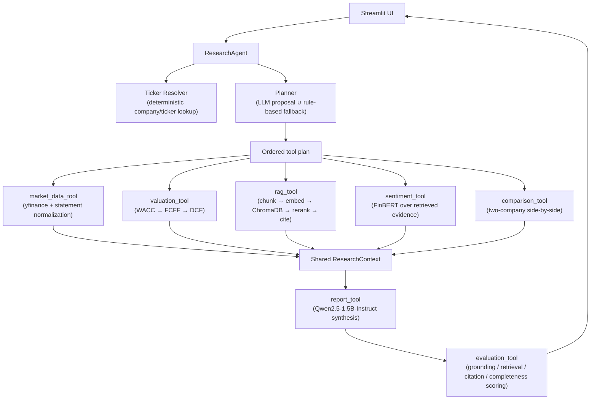

# FinSight AI — Agentic Financial Research Platform

**[Try the live demo →](https://huggingface.co/spaces/YOUR_HF_USERNAME/finsight-ai)** *(update this link once deployed — see [Deployment](#deployment))*

An agentic research assistant that answers open-ended financial questions ("Should I invest in Apple?", "What did management say about AI demand?") by planning which tools to run, executing them against live market data and earnings-call transcripts, and synthesizing a cited, self-scored equity research report — entirely with local, open-weight models (no external LLM API keys required).

---

## What it actually does

Ask a question, get back a structured report — Executive Summary, Bull Case, Bear Case, Financial Outlook, and Investment Recommendation — grounded in:

- **Live market data** pulled from yfinance (financial statements, market cap, beta, price history)
- **A real DCF valuation** (WACC → FCFF → enterprise value → intrinsic value), not a canned number
- **Retrieved earnings-call evidence**, reranked and cited, not paraphrased from the model's training data
- **FinBERT sentiment scoring** of that retrieved evidence
- **A self-evaluation pass** that scores the generated report's grounding, retrieval quality, citation coverage, and completeness before showing it to you

The system doesn't run a fixed pipeline for every question — an LLM planner decides which tools a given question actually needs (a valuation question skips RAG; a "what did management say" question skips the DCF), with a deterministic rule-based fallback so the plan never silently drops a tool the question clearly requires.

---

## Architecture



Every tool reads from and writes to one shared `ResearchContext` object, so `report_tool` and `evaluation_tool` always run last regardless of which evidence-gathering tools the planner chose.

---

## Tech Stack

| Layer | Tools |
|---|---|
| LLM (planning + report generation) | Qwen2.5-1.5B-Instruct (local, via 🤗 Transformers) |
| Retrieval | ChromaDB, `BAAI/bge-base-en-v1.5` embeddings, `cross-encoder/ms-marco-MiniLM-L-6-v2` reranker |
| Sentiment | FinBERT (`ProsusAI/finbert`) |
| Financial data | yfinance |
| Valuation | Custom WACC / FCFF / DCF engines (`app/valuation/`) |
| Interface | Streamlit |

---

## Supported companies

`market_data_tool` and `valuation_tool` work for **any valid yfinance ticker** — financial statement analysis and DCF valuation aren't limited to a fixed list.

Earnings-call **RAG and sentiment analysis** are grounded in transcripts currently shipped for **Apple (AAPL), Microsoft (MSFT), and NVIDIA (NVDA)** — see `app/data/transcripts/`. Asking about a company outside that set still returns financials/valuation, just without cited call evidence.

---

## Evaluation framework

Every generated report is scored, not just produced — `evaluation_tool` runs after every request and reports:

- **Grounding score** — how much of the answer is actually supported by retrieved evidence
- **Retrieval score** — relevance of the reranked chunks to the question
- **Citation coverage** — how much of the report cites its sources
- **Completeness** — whether all five required report sections were actually generated
- **Latency** — end-to-end wall-clock time

`app/evaluation/benchmark_runner.py` runs this scoring against a fixed benchmark set (`app/benchmarks/*.json`) so changes to prompts/retrieval/models can be compared against a baseline instead of eyeballed.

---

## Notable engineering decisions

A few things that were broken and got deliberately fixed, not just left alone:

- **The LLM planner could silently starve tools.** A small local model returning a *valid but wrong* plan (e.g. only `["rag_tool"]` for an investment question) meant the fallback rules never ran. Fixed by *unioning* the LLM's plan with the deterministic rule-based plan — the LLM can add tools, never omit ones the rules say are required.
- **Every tool run reloaded its models from disk.** `ResearchAgent`/`ToolRegistry` are rebuilt fresh on every Streamlit click, which meant the reranker, embedding model, and FinBERT were being reconstructed (and reloaded from disk) on every single query. Fixed with process-wide singletons, mirroring the pattern already used for the shared Qwen generator — cut several seconds off every query after the first.
- **Ticker resolution is deliberately not LLM-based.** Entity resolution over a known, closed set of companies is a lookup problem, not a reasoning problem — asking an LLM to "spell the ticker correctly" is an unnecessary source of hallucination.
- **Report generation length is a tuned tradeoff, not a default.** The model reliably fills a 5-section report template but doesn't reliably stop — the token budget and a drift-detection trim step (`_trim_runaway_output` in `report_tool.py`) exist specifically to stop the model from wandering into meta-commentary that would otherwise get scored as part of the report.

---

## Running locally

```bash
git clone https://github.com/shivaumsharma/FinSight-AI.git
cd FinSight-AI
pip install -r requirements.txt
streamlit run streamlit_app.py
```

First run downloads ~4 models (Qwen2.5-1.5B, FinBERT, the embedding model, and the reranker) from Hugging Face — subsequent runs reuse the cached weights.

---

## Deployment

This app is deployed on **Hugging Face Spaces** rather than Streamlit Community Cloud: the local models loaded here (Qwen2.5-1.5B ≈ 6GB in fp32, plus FinBERT, the embedding model, and the reranker) exceed Streamlit Cloud's free-tier memory limit. HF Spaces' free CPU tier (16GB RAM) comfortably fits the full model set.

To deploy your own copy:
1. Create a Space at [huggingface.co/new-space](https://huggingface.co/new-space) — SDK: **Streamlit**, Hardware: **CPU basic (free)**.
2. Link it to this GitHub repo (Space Settings → "Link to a GitHub repository"), or push directly: `git remote add space https://huggingface.co/spaces/<you>/<space-name>` then `git push space main`.
3. The `sdk`/`app_file` front matter at the top of this README configures the Space automatically.

---

## Roadmap

**Completed:** financial statement normalization, DCF/FCFF/WACC engines, ChromaDB + cross-encoder retrieval, query intent classification, FinBERT sentiment, agentic LLM+rule-based tool planning, self-evaluation scoring, benchmark framework.

**Planned:** hybrid retrieval (vector + BM25), multi-quarter financial reasoning, broader transcript/company coverage, an automated evaluation dashboard, portfolio-level analysis.

---

## Author

**Shivaum Sharma** — Computer Science Engineering (Data Science), Manipal Institute of Technology
