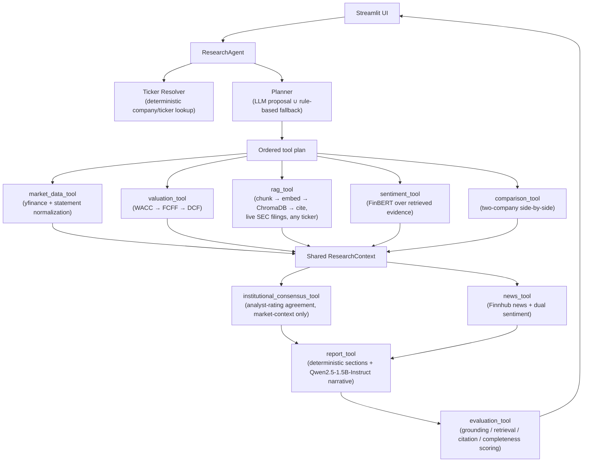

# FinSight AI — Agentic Financial Research Platform

**[Try the live demo →](https://shivaum-finsight-ai.streamlit.app)**

An agentic research assistant that answers open-ended financial questions ("Should I invest in Apple?", "What did management say about AI demand?") by planning which tools to run, executing them against live market data and SEC filings, and synthesizing a cited, self-scored equity research report — entirely with local, open-weight models (no external LLM API keys required).

---

## What it actually does

Ask a question, get back a 14-section institutional-style research report — company overview, financial/ratio/growth/valuation analysis, an LLM-written narrative (Executive Summary, Business Analysis, Market and Earnings Analysis, Risk Analysis, Investment Thesis), a Buy/Hold/Sell recommendation, confidence scores, and a downloadable PDF — grounded in:

- **Live market data** pulled from yfinance (financial statements, market cap, beta, price history)
- **A real DCF valuation** (WACC → FCFF → enterprise value → intrinsic value), not a canned number
- **Retrieved SEC filing evidence**, cited, not paraphrased from the model's training data
- **FinBERT sentiment scoring** of that retrieved evidence
- **A self-evaluation pass** that scores the generated report's grounding, retrieval quality, citation coverage, and completeness before showing it to you

The system doesn't run a fixed pipeline for every question — an LLM planner decides which tools a given question actually needs (a valuation question skips RAG; a "what did management say" question skips the DCF), with a deterministic rule-based fallback so the plan never silently drops a tool the question clearly requires.

---

## Architecture


```mermaid
flowchart TD
    UI["Streamlit UI"] --> Agent["ResearchAgent"]
    Agent --> Resolver["Ticker Resolver\n(deterministic company/ticker lookup)"]
    Agent --> Planner["Planner\n(LLM proposal ∪ rule-based fallback)"]
    Planner --> Plan["Ordered tool plan"]

    Plan --> MarketTool["market_data_tool\n(yfinance + statement normalization)"]
    Plan --> ValuationTool["valuation_tool\n(WACC → FCFF → DCF)"]
    Plan --> RAGTool["rag_tool\n(chunk → embed → ChromaDB → cite,\nlive SEC filings, any ticker)"]
    Plan --> SentimentTool["sentiment_tool\n(FinBERT over retrieved evidence)"]
    Plan --> ComparisonTool["comparison_tool\n(two-company side-by-side)"]

    MarketTool --> Context["Shared ResearchContext"]
    ValuationTool --> Context
    RAGTool --> Context
    SentimentTool --> Context
    ComparisonTool --> Context

    Context --> ConsensusTool["institutional_consensus_tool\n(analyst-rating agreement, market-context only)"]
    Context --> NewsTool["news_tool\n(Finnhub news + dual sentiment)"]
    ConsensusTool --> ReportTool["report_tool\n(deterministic sections + Qwen2.5-1.5B-Instruct narrative)"]
    NewsTool --> ReportTool
    ReportTool --> EvalTool["evaluation_tool\n(grounding / retrieval / citation / completeness scoring)"]
    EvalTool --> UI
```

Every tool reads from and writes to one shared `ResearchContext` object. The planner only chooses among the five evidence-gathering tools at the top; `institutional_consensus_tool`, `news_tool`, `report_tool`, and `evaluation_tool` always run afterward regardless of what the planner picked — there's no reasoning needed on "should this run."

---

## Tech Stack

| Layer | Tools |
|---|---|
| LLM (planning + report generation) | Qwen2.5-1.5B-Instruct, served locally via `llama.cpp` (Q8_0 GGUF) |
| Retrieval | ChromaDB + `BAAI/bge-base-en-v1.5` embeddings, raw (a cross-encoder reranker was tried and measured worse — see [EVALUATION.md](EVALUATION.md)) |
| Filing sourcing | Live SEC EDGAR API (`app/data/sec_edgar_client.py`) — any ticker with a CIK, not a fixed set |
| Sentiment | FinBERT (`ProsusAI/finbert`) — scored separately for SEC filing tone and recent news tone |
| Financial data | yfinance |
| News | Finnhub company-news API, keyword-categorized by risk type |
| Institutional ratings | yfinance analyst upgrades/downgrades, normalized into a Buy/Hold/Sell consensus check |
| Valuation | Custom WACC / FCFF / DCF engines (`app/valuation/`) |
| Company resolution | Regex + fuzzy match (rapidfuzz) against SEC's ~10,000-company index — deterministic, not LLM-based |
| Report output | reportlab (downloadable PDF) |
| Interface | Streamlit |

---

## Company coverage

There is no fixed company list. `market_data_tool` and `valuation_tool` work for **any valid yfinance ticker**, and `rag_tool` sources evidence live from **any ticker SEC has a CIK for** — the most recent 8-K earnings-release exhibit, falling back to a 10-Q/10-K's MD&A section, fetched directly from SEC EDGAR's public API (`app/data/sec_edgar_client.py`), not from hand-authored transcript files.

A ticker with no qualifying SEC filing (some foreign private issuers file 20-F/6-K instead of 10-K/10-Q/8-K) still returns financials and a DCF valuation, just without cited evidence or sentiment.

---

## Evaluation framework

Every generated report is scored, not just produced — `evaluation_tool` runs after every request and reports:

- **Grounding score** — how much of the answer is actually supported by retrieved evidence
- **Retrieval score** — relevance of the retrieved chunks to the question
- **Citation coverage** — how much of the report cites its sources
- **Completeness** — whether all five required report sections were actually generated
- **Latency** — end-to-end wall-clock time

`app/evaluation/benchmark_runner.py` runs this scoring against a fixed benchmark set (`app/benchmarks/*.json`) so changes to prompts/retrieval/models can be compared against a baseline instead of eyeballed.

**[Full results, including the backtest findings that didn't come out as hoped →](EVALUATION.md)** — point-in-time recommendation backtest across 1,000+ tickers, the RAG reranker that was measured and rejected, embedding fine-tune methodology, and ML classifier metrics.

---

## Notable engineering decisions

A few things that were broken and got deliberately fixed, not just left alone:

- **The LLM planner could silently starve tools.** A small local model returning a *valid but wrong* plan (e.g. only `["rag_tool"]` for an investment question) meant the fallback rules never ran. Fixed by *unioning* the LLM's plan with the deterministic rule-based plan — the LLM can add tools, never omit ones the rules say are required.
- **Every tool run reloaded its models from disk.** `ResearchAgent`/`ToolRegistry` are rebuilt fresh on every Streamlit click, which meant the reranker, embedding model, and FinBERT were being reconstructed (and reloaded from disk) on every single query. Fixed with process-wide singletons, mirroring the pattern already used for the shared Qwen generator — cut several seconds off every query after the first.
- **Ticker resolution is deliberately not LLM-based.** Entity resolution over a known, enumerable set of ~10,000 SEC-registered companies is a lookup problem, not a reasoning problem — asking an LLM to "spell the ticker correctly" is an unnecessary source of hallucination.
- **The cross-encoder reranker made retrieval worse, not better.** Measured, not assumed: a hand-labeled retrieval eval (`scripts/evaluate_retrieval.py`) showed mean Precision@5 drop from 0.552 (raw embedding retrieval) to 0.438 with reranking, and a live A/B on one real query showed citation-grounding collapse from 60.0 to 0.0 with the reranker active. `rag_tool.py` uses raw retrieval directly; the reranker code stays in the repo as a documented, evaluated, and rejected approach — see [EVALUATION.md](EVALUATION.md).
- **Narrative generation needs guardrails, not just a good prompt.** The local model reliably writes all five narrative sections in the right order with real content, but doesn't reliably stay consistent with the deterministic Buy/Hold/Sell verdict it's given, or cleanly separate a heading from the sentence before it. `narrative_builder.py` handles this with a drift detector (trims meta-commentary and repetition once the model starts wandering past what it actually has to say), a deterministic contradiction guardrail (flags bullish phrasing against a Sell rating and vice versa, appending a corrective note rather than trusting the prompt alone), and a heading-normalization pass before section-splitting.

---

## Running locally

```bash
git clone https://github.com/shivaumsharma/FinSight-AI.git
cd FinSight-AI
pip install -r requirements.txt
streamlit run streamlit_app.py
```

First run downloads ~3 models (Qwen2.5-1.5B, FinBERT, and the embedding model) from Hugging Face — subsequent runs reuse the cached weights.

---

## Deployment

This app is deployed on **Hugging Face Spaces** rather than Streamlit Community Cloud: the local models loaded here (Qwen2.5-1.5B as a quantized GGUF via `llama.cpp`, plus FinBERT and the embedding model) exceed Streamlit Cloud's free-tier memory limit. HF Spaces' free CPU tier (16GB RAM) comfortably fits the full model set.

To deploy your own copy:
1. Create a Space at [huggingface.co/new-space](https://huggingface.co/new-space) — SDK: **Streamlit**, Hardware: **CPU basic (free)**.
2. Link it to this GitHub repo (Space Settings → "Link to a GitHub repository"), or push directly: `git remote add space https://huggingface.co/spaces/<you>/<space-name>` then `git push space main`.
3. The `sdk`/`app_file` front matter at the top of this README configures the Space automatically.

---

## Roadmap

**Completed:** financial statement normalization, DCF/FCFF/WACC engines, live SEC EDGAR sourcing + ChromaDB retrieval, query intent classification, FinBERT sentiment, agentic LLM+rule-based tool planning, self-evaluation scoring, benchmark framework, institutional consensus scoring, news-grounded risk analysis.

**Planned:** hybrid retrieval (vector + BM25), multi-quarter financial reasoning, an automated evaluation dashboard, portfolio-level analysis.

---

## Author

**Shivaum Sharma** — Computer Science Engineering (Data Science), Manipal Institute of Technology
