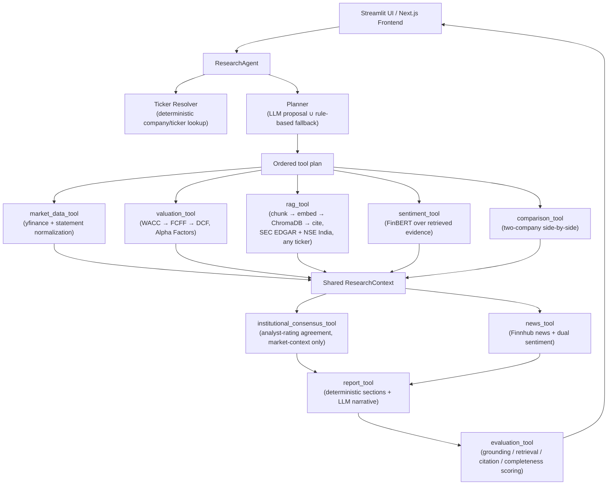
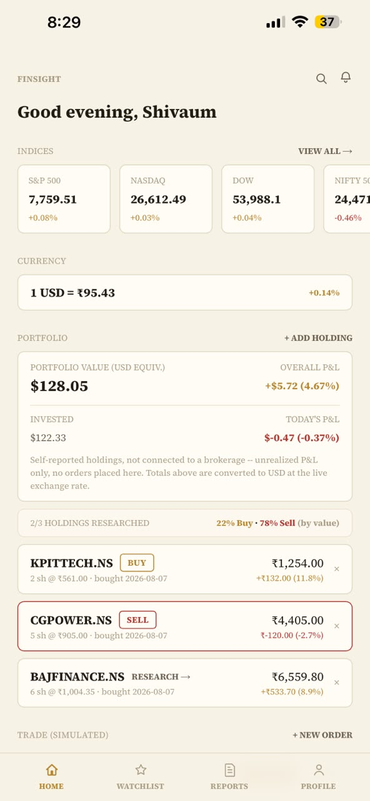
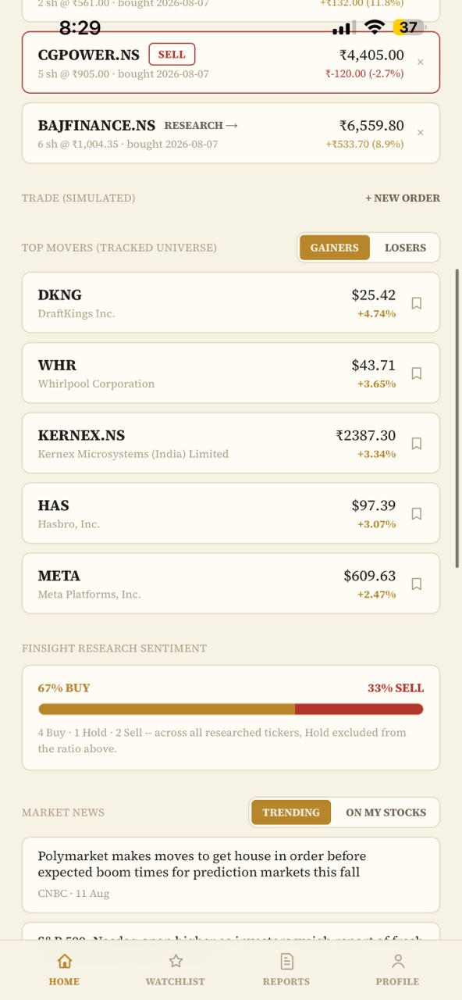
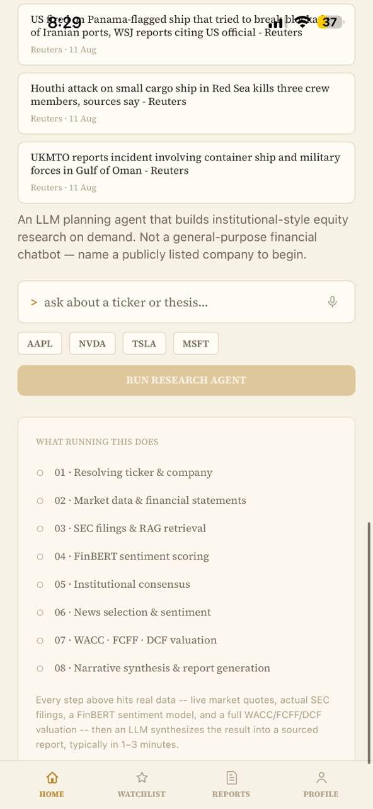
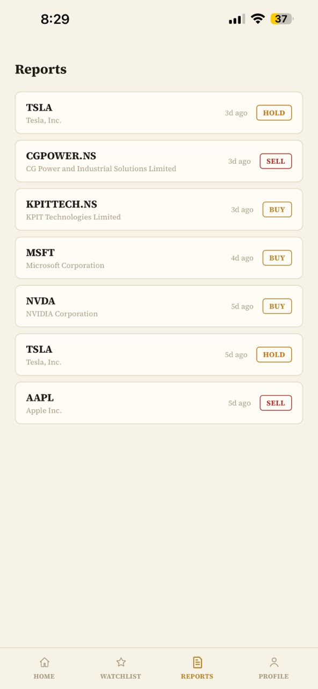
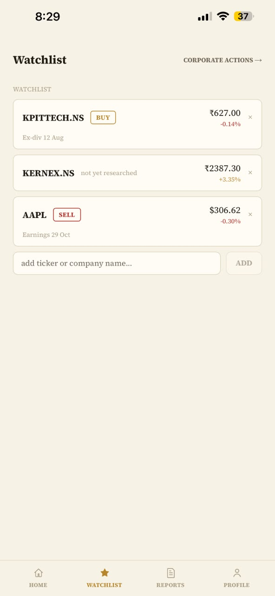
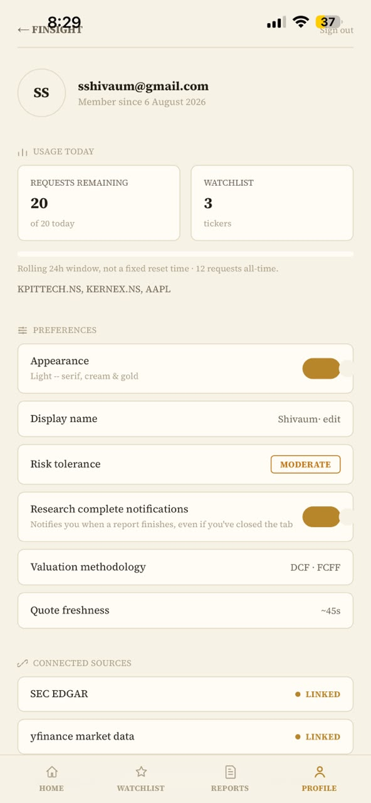
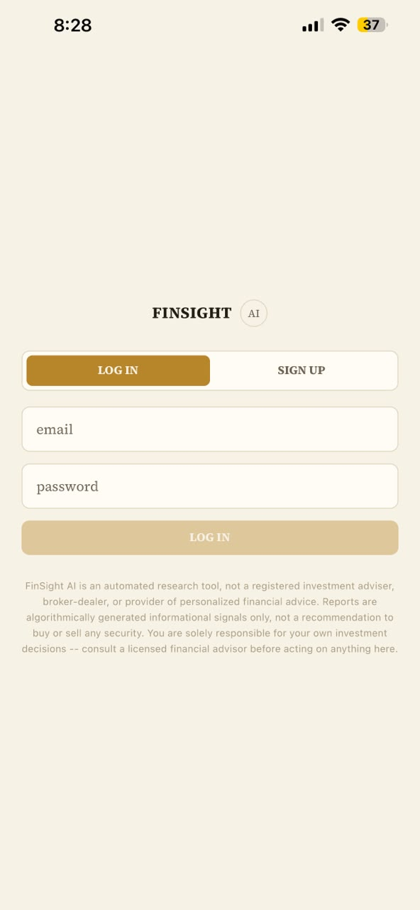

# FinSight AI — Agentic Financial Research & Trading Platform

An agentic equity-research and paper-trading platform built using Python, FastAPI, Next.js, and a self-hosted or hosted LLM backend to plan, retrieve, value, and write institutional-style research on any publicly listed company — grounded in live market data and real SEC/NSE filings, not the model's training data.

The platform combines an LLM tool-planning agent, a real DCF valuation engine, retrieval-augmented generation over live regulatory filings, a self-evaluation scoring pass, a 31-signal quantitative factor scorecard, a simulated paper-trading layer, voice input, and a rigorously benchmarked evaluation framework into one deployable, tested system.

**[Try the research demo →](https://shivaum-finsight-ai.streamlit.app)** · **[Try the full platform →](https://web-ten-blond-39.vercel.app)**

---

## Vision

Most "AI investing" tools are chatbots wrapped around a generic LLM's training data — confident-sounding, ungrounded, and unable to tell you why they said what they said. FinSight's premise is the opposite: every claim in a report should trace back to a live filing, a real quote, or an actual computed valuation, and the system should be honest about its own limitations (small training sets, a DCF's structural blind spots, a benchmark result that didn't come out as hoped) rather than hide them.

The longer-term direction is a full voice-driven research copilot — "Hey FinSight, check my stocks." Tap-to-talk transcription, spoken replies, a hands-free continuous voice session, and voice-driven onboarding are shipped; full spoken app navigation is next.

---

## Features

- LLM planning agent that decides which tools a question actually needs (a valuation question skips RAG; a "what did management say" question skips the DCF)
- Real DCF valuation: WACC → FCFF forecast → enterprise value → intrinsic value, with a 5×5 sensitivity grid and 2,000-sample Monte Carlo simulation
- Retrieval-augmented generation over **live** SEC EDGAR filings (US tickers) and **live** NSE India corporate announcements (`.NS` tickers) — cited, not paraphrased from training data
- FinBERT sentiment scoring, run separately over filing tone and recent news tone
- Self-evaluation pass: every report scores its own grounding, retrieval quality, citation coverage, and completeness before it's shown to you
- 31-signal Alpha Factors scorecard (Piotroski F-Score, Altman Z-Score, momentum, relative strength, macro sensitivity) — strictly display-only, architecturally and test-enforced to never influence the recommendation
- Signal Quality panel that separates *direction* (the rating) from *confidence in the evidence behind it*
- Institutional Consensus scoring against real analyst ratings, with a small-sample-size caveat
- Concurrent multi-model "second opinion" — three independent LLMs vote on the same evidence
- Simulated paper trading: watchlist, self-reported portfolio, order execution with real weighted-average-cost-basis accounting — no real money, ever
- Voice input/output: tap-to-talk mic button (Sarvam AI Speech-to-Text, auto-stops on silence) plus opt-in spoken replies (Sarvam AI Text-to-Speech) and a hands-free continuous voice session on Chat and Home
- Voice-driven onboarding: new users can answer the risk-tolerance/goals questionnaire by voice, classified against the expected answer set
- A shared conversational assistant (multi-turn memory, portfolio-grounded answers) surfaced both as a full Chat page and a compact always-active widget on Home
- Real Black-Scholes-Merton options pricing: Greeks (delta/gamma/theta/vega/rho) and implied volatility solved numerically against **live** option chains, alongside realized volatility — a separate, from-scratch quantitative model, not a third-party pricing API
- Full auth system (PBKDF2, HMAC-signed share links), Progressive Web App with offline support and Web Push notifications
- Point-in-time backtesting harness with explicit no-look-ahead controls, run across 1,000+ tickers

---

## Platform Capabilities

### Research Engine
Ask a question, get back a 14-section institutional-style report — company overview, financial/ratio/growth/valuation analysis, an LLM-written narrative (Executive Summary, Business Analysis, Market & Earnings Analysis, Risk Analysis, Investment Thesis), a Buy/Hold/Sell recommendation, confidence scores, and a downloadable PDF.

### Predictive & Quantitative Analytics
A custom WACC/FCFF/DCF engine, a Logistic Regression vs. XGBoost valuation classifier (display-only, honestly gated on training-set size), and a 31-factor quantitative scorecard spanning financial, quality, valuation, market, risk, sentiment, and macro signals.

### Options & Derivatives
A from-scratch Black-Scholes-Merton pricer (`app/derivatives/options_pricer.py`) computes theoretical price and the five Greeks against every strike in a ticker's real, live option chain, near the money. Implied volatility is solved numerically per contract (Newton-Raphson with a bisection fallback) against the option's actual market price — not read off a third-party field — then cross-checked alongside realized volatility from historical returns. Degrades honestly: a quote priced below its own intrinsic value returns `null` Greeks rather than a fabricated number, and a ticker with no listed options market (most non-US listings) returns a clear "unavailable" state, not an error.

### Evaluation Framework
Every report is scored, not just produced — grounding (40%), retrieval quality (20%), citation coverage (20%), and completeness (20%). A dedicated benchmark harness checks prompt/retrieval/model changes against a fixed baseline instead of eyeballing them. Full methodology and results — including the ones that didn't come out as hoped — in [EVALUATION.md](EVALUATION.md).

### Trading Platform
Self-reported portfolio tracking, a global watchlist, Top Movers and a market Sentiment Gauge over a real tracked universe, Corporate Actions and Global Indices feeds, and simulated paper order execution — a rehearsal tool for a trade decision against real prices, never a real broker connection.

### Voice Input
A mic button transcribes your spoken question via Sarvam AI's Speech-to-Text API and fills it into the question box for you to review before submitting — never auto-submitted, so a mistranscription costs nothing but the API call.

### Account, Offline & Notifications
Session-based auth, HMAC-signed shareable PDF links, a service worker with offline fallback and cache-first static assets, and end-to-end encrypted Web Push notifications when a long-running report finishes.

---

## Architecture


```mermaid
flowchart TD
    UI["Streamlit UI / Next.js Frontend"] --> Agent["ResearchAgent"]
    Agent --> Resolver["Ticker Resolver\n(deterministic company/ticker lookup)"]
    Agent --> Planner["Planner\n(LLM proposal ∪ rule-based fallback)"]
    Planner --> Plan["Ordered tool plan"]

    Plan --> MarketTool["market_data_tool\n(yfinance + statement normalization)"]
    Plan --> ValuationTool["valuation_tool\n(WACC → FCFF → DCF, Alpha Factors)"]
    Plan --> RAGTool["rag_tool\n(chunk → embed → ChromaDB → cite,\nSEC EDGAR + NSE India, any ticker)"]
    Plan --> SentimentTool["sentiment_tool\n(FinBERT over retrieved evidence)"]
    Plan --> ComparisonTool["comparison_tool\n(two-company side-by-side)"]

    MarketTool --> Context["Shared ResearchContext"]
    ValuationTool --> Context
    RAGTool --> Context
    SentimentTool --> Context
    ComparisonTool --> Context

    Context --> ConsensusTool["institutional_consensus_tool\n(analyst-rating agreement, market-context only)"]
    Context --> NewsTool["news_tool\n(Finnhub news + dual sentiment)"]
    ConsensusTool --> ReportTool["report_tool\n(deterministic sections + LLM narrative)"]
    NewsTool --> ReportTool
    ReportTool --> EvalTool["evaluation_tool\n(grounding / retrieval / citation / completeness scoring)"]
    EvalTool --> UI
```

Every tool reads from and writes to one shared `ResearchContext` object. The planner only chooses among the five evidence-gathering tools at the top; `institutional_consensus_tool`, `news_tool`, `report_tool`, and `evaluation_tool` always run afterward regardless of what the planner picked.

---

## Tech Stack

| Layer | Tools |
|---|---|
| LLM (planning + report generation) | Hosted OpenAI-compatible chat API by default (`LLM_PROVIDER=hosted`, Groq/Together/OpenRouter/OpenAI); Qwen2.5-1.5B-Instruct served locally via `llama.cpp` (Q8_0 GGUF) with `LLM_PROVIDER=local` |
| Backend API | FastAPI, session auth (PBKDF2-SHA256, 600k iterations), SQLite (stdlib, no ORM), background job queue |
| Frontend | Next.js 16 (App Router), React 19, TypeScript, Tailwind CSS, PWA (service worker, Web Push) |
| Retrieval | ChromaDB + `BAAI/bge-base-en-v1.5` embeddings, raw (a cross-encoder reranker was tried and measured worse — see [EVALUATION.md](EVALUATION.md)) |
| Filing sourcing | Live SEC EDGAR API (US tickers) + live NSE India corporate-announcements API (`.NS` tickers) — any ticker with coverage, not a fixed set |
| Sentiment | FinBERT (`ProsusAI/finbert`) — scored separately for filing tone and news tone |
| Financial data | yfinance, with in-process caching and a batched-request pattern to survive cloud-datacenter IP throttling |
| News | Finnhub company-news API, keyword-categorized by risk type |
| Voice | Sarvam AI Speech-to-Text (`saaras:v3`), browser `MediaRecorder` + Web Audio silence detection |
| Valuation | Custom WACC / FCFF / DCF engines, Monte Carlo simulation, Logistic Regression / XGBoost classifier |
| ML training | GRPO reinforcement fine-tuning (LoRA on Qwen2.5-7B via `trl`/`peft`) using realized returns as a verifiable reward |
| Company resolution | Regex + fuzzy match (rapidfuzz) against SEC's ~10,000-company index and NSE's index — deterministic, not LLM-based |
| Orchestration | Hand-rolled controller, plus a LangGraph port kept alongside it as a documented, benchmarked alternative — see [EVALUATION.md](EVALUATION.md) |
| Caching | Redis — content-addressed for valuation/narrative output, TTL-only for statement fetches; degrades to a no-op if unreachable |
| Report output | reportlab (downloadable PDF) |
| Deployment | Google Cloud Run (API) + Vercel (frontend); Streamlit Community Cloud / Hugging Face Spaces (research demo); Railway supported as an alternative |
| Testing / CI | pytest (540+ test functions, 34 files), GitHub Actions with failure-annotation diagnostics |

---

## Project Structure

```
Autonomous_Financial_Research_Agent/
│
├── app/                        # Core Python backend
│   ├── agents/                 # ResearchAgent + LangGraph orchestration
│   ├── analysis/                # Alpha Factors engine (31 signals, 7 categories)
│   ├── api/                    # FastAPI service — auth, jobs, voice, main
│   ├── benchmarks/               # Fixed evaluation benchmark sets
│   ├── core/                   # LLM provider abstraction, retry, cache, currency
│   ├── data/                   # SEC EDGAR, NSE India, Sarvam STT/TTS, market data clients
│   ├── derivatives/               # Black-Scholes options pricer, Greeks, implied vol
│   ├── evaluation/               # Grounding / citation / retrieval scorers
│   ├── nlp/                    # Sentiment summarization
│   ├── planner/                 # LLM + rule-based tool planning
│   ├── rag/                    # Chunking, embeddings, ChromaDB, report generation
│   ├── reasoning/               # Market movers, model consensus, backtest stats
│   ├── reporting/               # Report/PDF building, news, institutional ratings
│   ├── tests/                  # 800+ tests across 49 files
│   ├── tools/                  # Agent tools (market, valuation, RAG, sentiment, ...)
│   ├── training/                # GRPO / RLVR fine-tuning pipeline
│   ├── utils/
│   └── valuation/                # WACC / FCFF / DCF engines + ML classifier
│
├── web/                        # Next.js 16 production frontend
│   ├── src/
│   │   ├── app/                 # App Router pages + backend proxy routes
│   │   ├── components/          # ReportView, VoiceInputButton, Portfolio, ...
│   │   └── lib/                 # useResearch, auth session, config
│   └── public/                  # Service worker, PWA icons
│
├── scripts/                    # Backtests, benchmarks, training-set builders
├── streamlit_app.py              # Original Streamlit research demo
├── EVALUATION.md                 # Full evaluation results & methodology
├── requirements.txt
├── Dockerfile
└── README.md
```

---

## Key Engineering Highlights

- Built a point-in-time backtesting harness with explicit no-look-ahead controls (filing-lag gating, trailing-window beta, as-of-date pricing) across 1,000+ tickers and two independent historical windows; used it to find and remove a recommendation rule that measurably hurt accuracy, rather than assuming it helped.
- Diagnosed via a hand-labeled precision/NDCG/MRR evaluation that a cross-encoder reranker was silently *degrading* RAG retrieval quality, and shipped the fix (raw retrieval) with the disproved approach documented in place, not deleted.
- Fine-tuned a retrieval embedding model with contrastive learning and a frozen-candidate-pool evaluation methodology — then correctly declined to ship it once the evaluation showed it underperformed baseline.
- Built an ML valuation classifier with stratified k-fold CV and a held-out test split, while being explicit that a small training set doesn't yet clear the bar for production and gating it out of the recommendation logic until it does.
- Designed and implemented a GRPO reinforcement-learning fine-tuning pipeline (LoRA on Qwen2.5-7B) using realized stock returns as a verifiable reward, with a two-axis (ticker + time-window) holdout to prevent train/eval leakage.
- Ported the agent's control flow onto LangGraph as a benchmarked alternative — catching and discarding a misleading first measurement (network I/O variance that looked like a 30x orchestration difference) before reporting the real, isolated overhead number.
- Diagnosed and fixed a check-then-act concurrency race in a production rate limiter using SQLite's `BEGIN IMMEDIATE`, verified with a dedicated multi-threaded test since the bug was invisible under sequential testing.
- Root-caused a production API integration returning as few as 1–3/80 successful results down to per-request cloud-IP throttling (not the fetch logic), and fixed it with a single batched request — verified against the live deployment.
- Implemented auth from stdlib primitives only: PBKDF2-SHA256 at 600,000 iterations, constant-time comparison, HMAC-signed share links with the expiry baked into the signed payload itself, and end-to-end encrypted Web Push.
- Reverse-engineered a live, undocumented NSE India filings API through a manual endpoint spike (not guesswork), correctly identifying which subdomains required browser-spoofed headers — verified end-to-end against the production deployment before shipping.
- Diagnosed a 3-day silent CI outage by building a GitHub Actions failure-annotation mechanism rather than guessing at fixes, tracing it to a live-network test blocked by GitHub's own IP ranges.
- Added a two-tier Redis caching layer (content-addressed for correctness-sensitive output, TTL-only for genuinely time-bound data) and measured real 500–1,700x cache-hit speedups — after catching a cross-contamination bug in the benchmark's own methodology first.
- Built a Black-Scholes-Merton options pricer from scratch (no third-party pricing library) with a numerically-solved implied-volatility root-finder against live market quotes, not a pre-computed vendor field; verified against textbook reference values to 4 decimal places and, separately, against a real live option chain where theoretical price matched market price to the cent everywhere the solver converged.

---

## Models & Methodology

**Valuation**: a from-scratch WACC → FCFF → DCF engine, cross-checked against relative (EV/EBITDA) valuation and a Monte Carlo simulation over growth/WACC/terminal-growth uncertainty. The Buy/Hold/Sell threshold and DCF/relative-valuation blend weights were tuned via backtesting across two independent historical windows, not chosen by hand.

**ML valuation classifier**: Logistic Regression vs. XGBoost/GradientBoosting, trained on realized forward-return outcomes from the platform's own point-in-time backtest (not analyst agreement, avoiding look-ahead bias), evaluated with stratified 5-fold CV *and* a held-out test split with per-class precision/recall. Explicitly display-only — never part of the recommendation composite.

**RLVR / GRPO fine-tuning**: a from-scratch reinforcement-learning pipeline (`app/training/`) that fine-tunes a local LLM to predict Buy/Hold/Sell using realized stock returns as a binary, verifiable reward — built and unit-tested, not yet executed to a trained checkpoint.

**Honest limitations**, documented rather than hidden: the DCF's fixed terminal-growth assumption structurally undervalues high-growth compounders relative to mature businesses, and backtested directional accuracy currently loses to a naive always-Buy baseline in both tested windows. Full numbers, methodology, and the reasoning behind every one of these findings are in [EVALUATION.md](EVALUATION.md).

---

## Installation

**Research demo (Streamlit):**
```bash
git clone https://github.com/shivaumsharma/FinSight-AI.git
cd FinSight-AI
pip install -r requirements.txt
cp .env.example .env  # fill in FINNHUB_API_KEY and, for the default hosted LLM, LLM_BASE_URL/LLM_API_KEY/LLM_MODEL
streamlit run streamlit_app.py
```
The LLM defaults to a hosted, OpenAI-compatible chat API (`LLM_PROVIDER=hosted`). Set `LLM_PROVIDER=local` to run entirely on-box with no external LLM API key, via Qwen2.5-1.5B served locally through `llama.cpp`. First run downloads FinBERT and the embedding model (and Qwen2.5-1.5B, if running local) from Hugging Face; subsequent runs reuse the cached weights.

**Full platform (FastAPI + Next.js):**
```bash
# Backend
python -m uvicorn app.api.main:app --port 8010 --env-file .env

# Frontend (separate terminal)
cd web
npm install
npm run dev
```
See `.env.example` and `web/.env.example` for the full list of required/optional environment variables.

---

## Screenshots

| | |
|---|---|
| **Home Dashboard** — indices, live FX, self-reported portfolio with real weighted-average P&L | **Top Movers & Sentiment** — tracked-universe gainers, a research sentiment gauge across all rated tickers |
|  |  |
| **Research Agent** — market news feed, ticker/thesis input with voice mic, and the live 8-step pipeline | **Reports** — every past report, ticker, recommendation, and age at a glance |
|  |  |
| **Watchlist** — tracked tickers with live quotes, ratings, corporate-action dates | **Profile** — usage quota, preferences, connected data sources, session management |
|  |  |
| **Login** | |
|  | |

---

## Deployment

Production runs the FastAPI service on **Google Cloud Run** and the Next.js frontend on **Vercel**; the research demo runs separately on **Hugging Face Spaces** (the local model set exceeds Streamlit Community Cloud's free-tier memory limit). Railway remains fully supported as an alternative single-service deploy for the API.

**Research demo (Hugging Face Spaces):**
1. Create a Space at [huggingface.co/new-space](https://huggingface.co/new-space) — SDK: **Streamlit**, Hardware: **CPU basic (free)**.
2. Link it to this GitHub repo (Space Settings → "Link to a GitHub repository"), or push directly: `git remote add space https://huggingface.co/spaces/<you>/<space-name>` then `git push space main`.
3. The `sdk`/`app_file` front matter at the top of this README configures the Space automatically.

**Backend (Cloud Run), one-time setup:**
1. Create a GCP project, enable Cloud Run, Cloud Build, and Artifact Registry.
2. Cloud Console → Cloud Run → **Create Service → Continuously deploy from a repository** → connect this GitHub repo, branch `main`, build type Dockerfile. This provisions the Cloud Run service and a Cloud Build trigger.
3. Set every var from `.env.example` on the service (Console → **Edit & Deploy New Revision → Variables**, or `gcloud run services update <service> --region=<region> --update-env-vars KEY=value,...`). `API_KEY` is required before this is exposed anywhere public.
4. Cloud Run's filesystem is ephemeral across revisions by default — point `DATA_DIR` at a real persistent volume (Cloud Storage FUSE or Filestore) if `jobs.db`/`reports/`/`llm_logs/` need to survive a redeploy.

**Redeploy the backend:**
```bash
gcloud builds triggers run <your-trigger-id> --region=global --branch=main
```

**Verify:**
```bash
curl https://<your-cloud-run-url>/health
curl -X POST https://<your-cloud-run-url>/v1/research \
  -H "X-API-Key: your-api-key" -H "Content-Type: application/json" \
  -d '{"question": "Should I invest in Apple?"}'
```

**Frontend (Vercel), one-time setup:**
```bash
cd web
npx vercel@latest link
```
Then set `FINSIGHT_API_URL` (the Cloud Run URL above) and `FINSIGHT_API_KEY` (matching `API_KEY` on the backend) as Environment Variables in the Vercel dashboard.

**Redeploy the frontend:**
```bash
cd web && npx vercel@latest --prod
```

**Alternative: Railway** — the committed `Dockerfile`/`railway.json` support a one-service Railway deploy for the API (`railway login`, `railway init`, attach a persistent volume for `jobs.db`/`reports/`, `railway variables set ...` for each `.env.example` key, `railway up`). Potentially simpler for a from-scratch setup, since Railway auto-provisions its own build trigger instead of the manual Cloud Console wizard above.

---

## Testing & Quality

800+ test functions across 49 files, covering the recommendation engine, valuation pipeline, options pricer (Black-Scholes reference values, put-call parity, implied-vol round-trip), auth, RAG retrieval, the job queue's concurrency behavior, every external API client (SEC EDGAR, NSE India, Sarvam, Finnhub), and the full HTTP API surface — run via `pytest app/tests/`. CI runs on every push via GitHub Actions, with pytest failures re-emitted as annotations so a break is diagnosable from the Checks API without needing repo sign-in.

---

## Roadmap

**Completed:** financial statement normalization, DCF/FCFF/WACC engines, live SEC EDGAR + NSE India sourcing, ChromaDB retrieval, query intent classification, FinBERT sentiment, agentic LLM+rule-based tool planning, self-evaluation scoring, a benchmarked LangGraph orchestration alternative, Redis caching, full auth + PWA + Web Push, a simulated paper-trading platform, a 31-signal Alpha Factors scorecard, a Black-Scholes options-pricing/Greeks engine, two-way voice (input + spoken replies), voice-driven onboarding, and a shared multi-turn conversational assistant on both Chat and Home.

**Planned:** hybrid retrieval (vector + BM25), multi-quarter financial reasoning, an automated evaluation dashboard, portfolio-level analysis, a trained RLVR checkpoint, further voice-driven app navigation, Postgres migration, request-level rate limiting, a committed CD pipeline.

---

## Author

**Shivaum Shekhar Sharma** — Computer Science Engineering (Data Science), Manipal Institute of Technology
