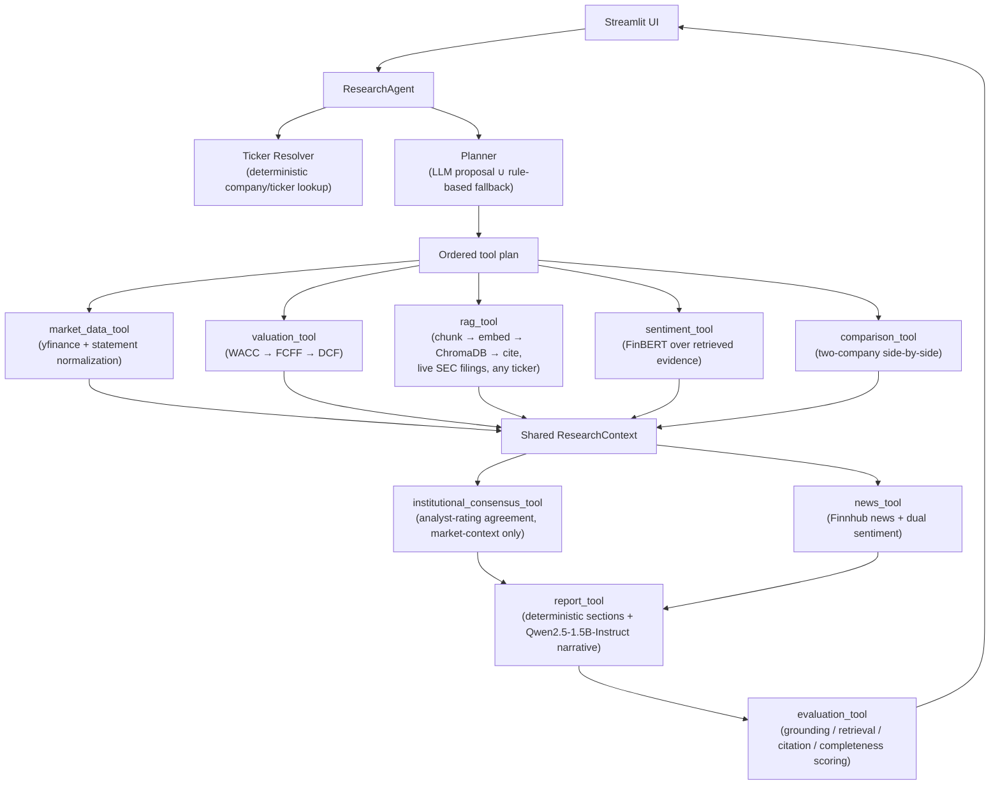

# FinSight AI — Agentic Financial Research Platform

**[Try the live demo →](https://shivaum-finsight-ai.streamlit.app)**

An agentic research assistant that answers open-ended financial questions ("Should I invest in Apple?", "What did management say about AI demand?") by planning which tools to run, executing them against live market data and SEC filings, and synthesizing a cited, self-scored equity research report. The LLM backend is pluggable (`app/core/llm_provider.py`): a hosted, OpenAI-compatible chat API (Groq, Together, OpenRouter, OpenAI, ...) by default, or a fully local, open-weight model (Qwen2.5-1.5B-Instruct via `llama.cpp`, no external API key) with `LLM_PROVIDER=local`.

---

## What it actually does

Ask a question, get back a 14-section institutional-style research report — company overview, financial/ratio/growth/valuation analysis, an LLM-written narrative (Executive Summary, Business Analysis, Market and Earnings Analysis, Risk Analysis, Investment Thesis), a Buy/Hold/Sell recommendation, confidence scores, and a downloadable PDF — grounded in:

- **Live market data** pulled from yfinance (financial statements, market cap, beta, price history)
- **A real DCF valuation** (WACC → FCFF → enterprise value → intrinsic value), not a canned number
- **Retrieved SEC filing evidence**, cited, not paraphrased from the model's training data
- **FinBERT sentiment scoring** of that retrieved evidence
- **A self-evaluation pass** that scores the generated report's grounding, retrieval quality, citation coverage, and completeness before showing it to you

The system doesn't run a fixed pipeline for every question — an LLM planner decides which tools a given question actually needs (a valuation question skips RAG; a "what did management say" question skips the DCF), with a deterministic rule-based fallback so the plan never silently drops a tool the question clearly requires.

---

## Architecture


```mermaid
flowchart TD
    UI["Streamlit UI"] --> Agent["ResearchAgent"]
    Agent --> Resolver["Ticker Resolver\n(deterministic company/ticker lookup)"]
    Agent --> Planner["Planner\n(LLM proposal ∪ rule-based fallback)"]
    Planner --> Plan["Ordered tool plan"]

    Plan --> MarketTool["market_data_tool\n(yfinance + statement normalization)"]
    Plan --> ValuationTool["valuation_tool\n(WACC → FCFF → DCF)"]
    Plan --> RAGTool["rag_tool\n(chunk → embed → ChromaDB → cite,\nlive SEC filings, any ticker)"]
    Plan --> SentimentTool["sentiment_tool\n(FinBERT over retrieved evidence)"]
    Plan --> ComparisonTool["comparison_tool\n(two-company side-by-side)"]

    MarketTool --> Context["Shared ResearchContext"]
    ValuationTool --> Context
    RAGTool --> Context
    SentimentTool --> Context
    ComparisonTool --> Context

    Context --> ConsensusTool["institutional_consensus_tool\n(analyst-rating agreement, market-context only)"]
    Context --> NewsTool["news_tool\n(Finnhub news + dual sentiment)"]
    ConsensusTool --> ReportTool["report_tool\n(deterministic sections + Qwen2.5-1.5B-Instruct narrative)"]
    NewsTool --> ReportTool
    ReportTool --> EvalTool["evaluation_tool\n(grounding / retrieval / citation / completeness scoring)"]
    EvalTool --> UI
```

Every tool reads from and writes to one shared `ResearchContext` object. The planner only chooses among the five evidence-gathering tools at the top; `institutional_consensus_tool`, `news_tool`, `report_tool`, and `evaluation_tool` always run afterward regardless of what the planner picked — there's no reasoning needed on "should this run."

---

## Tech Stack

| Layer | Tools |
|---|---|
| LLM (planning + report generation) | Hosted OpenAI-compatible chat API by default (`LLM_PROVIDER=hosted`); Qwen2.5-1.5B-Instruct served locally via `llama.cpp` (Q8_0 GGUF) with `LLM_PROVIDER=local` |
| Retrieval | ChromaDB + `BAAI/bge-base-en-v1.5` embeddings, raw (a cross-encoder reranker was tried and measured worse — see [EVALUATION.md](EVALUATION.md)) |
| Filing sourcing | Live SEC EDGAR API (`app/data/sec_edgar_client.py`) — any ticker with a CIK, not a fixed set |
| Sentiment | FinBERT (`ProsusAI/finbert`) — scored separately for SEC filing tone and recent news tone |
| Financial data | yfinance |
| News | Finnhub company-news API, keyword-categorized by risk type |
| Institutional ratings | yfinance analyst upgrades/downgrades, normalized into a Buy/Hold/Sell consensus check |
| Valuation | Custom WACC / FCFF / DCF engines (`app/valuation/`) |
| Company resolution | Regex + fuzzy match (rapidfuzz) against SEC's ~10,000-company index — deterministic, not LLM-based |
| Orchestration | Hand-rolled controller (`research_agent.py`), plus a LangGraph port (`langgraph_agent.py`) kept alongside it as a documented, benchmarked alternative — see [EVALUATION.md](EVALUATION.md) |
| Caching | Redis (`app/core/cache.py`) — content-addressed for valuation/narrative output, TTL-only for statement fetches; degrades to a no-op if unreachable |
| Report output | reportlab (downloadable PDF) |
| Interface | Streamlit |

---

## Company coverage

There is no fixed company list. `market_data_tool` and `valuation_tool` work for **any valid yfinance ticker**, and `rag_tool` sources evidence live from **any ticker SEC has a CIK for** — the most recent 8-K earnings-release exhibit, falling back to a 10-Q/10-K's MD&A section, fetched directly from SEC EDGAR's public API (`app/data/sec_edgar_client.py`), not from hand-authored transcript files.

A ticker with no qualifying SEC filing (some foreign private issuers file 20-F/6-K instead of 10-K/10-Q/8-K) still returns financials and a DCF valuation, just without cited evidence or sentiment.

---

## Evaluation framework

Every generated report is scored, not just produced — `evaluation_tool` runs after every request and reports:

- **Grounding score** — how much of the answer is actually supported by retrieved evidence
- **Retrieval score** — relevance of the retrieved chunks to the question
- **Citation coverage** — how much of the report cites its sources
- **Completeness** — whether all five required report sections were actually generated
- **Latency** — end-to-end wall-clock time

`app/evaluation/benchmark_runner.py` runs this scoring against a fixed benchmark set (`app/benchmarks/*.json`) so changes to prompts/retrieval/models can be compared against a baseline instead of eyeballed.

**[Full results, including the backtest findings that didn't come out as hoped →](EVALUATION.md)** — point-in-time recommendation backtest across 1,000+ tickers, the RAG reranker that was measured and rejected, embedding fine-tune methodology, and ML classifier metrics.

---

## Notable engineering decisions

A few things that were broken and got deliberately fixed, not just left alone:

- **The LLM planner could silently starve tools.** A small local model returning a *valid but wrong* plan (e.g. only `["rag_tool"]` for an investment question) meant the fallback rules never ran. Fixed by *unioning* the LLM's plan with the deterministic rule-based plan — the LLM can add tools, never omit ones the rules say are required.
- **Every tool run reloaded its models from disk.** `ResearchAgent`/`ToolRegistry` are rebuilt fresh on every Streamlit click, which meant the reranker, embedding model, and FinBERT were being reconstructed (and reloaded from disk) on every single query. Fixed with process-wide singletons, mirroring the pattern already used for the shared Qwen generator — cut several seconds off every query after the first.
- **Ticker resolution is deliberately not LLM-based.** Entity resolution over a known, enumerable set of ~10,000 SEC-registered companies is a lookup problem, not a reasoning problem — asking an LLM to "spell the ticker correctly" is an unnecessary source of hallucination.
- **The cross-encoder reranker made retrieval worse, not better.** Measured, not assumed: a hand-labeled retrieval eval (`scripts/evaluate_retrieval.py`) showed mean Precision@5 drop from 0.552 (raw embedding retrieval) to 0.438 with reranking, and a live A/B on one real query showed citation-grounding collapse from 60.0 to 0.0 with the reranker active. `rag_tool.py` uses raw retrieval directly; the reranker code stays in the repo as a documented, evaluated, and rejected approach — see [EVALUATION.md](EVALUATION.md).
- **Narrative generation needs guardrails, not just a good prompt.** The local model reliably writes all five narrative sections in the right order with real content, but doesn't reliably stay consistent with the deterministic Buy/Hold/Sell verdict it's given, or cleanly separate a heading from the sentence before it. `narrative_builder.py` handles this with a drift detector (trims meta-commentary and repetition once the model starts wandering past what it actually has to say), a deterministic contradiction guardrail (flags bullish phrasing against a Sell rating and vice versa, appending a corrective note rather than trusting the prompt alone), and a heading-normalization pass before section-splitting.
- **A framework rewrite is only as good as the benchmark behind it.** The first attempt to measure LangGraph's orchestration overhead against the hand-rolled controller produced a 964s outlier that looked like a dramatic difference — actually a stalled SEC/yfinance call on that one run, not the framework. Isolating pure control-flow dispatch (all tools stubbed, 20 reps, median reported) instead found the real, honest number: ~7-13ms of LangGraph overhead per run, negligible against the tens of seconds real tool execution takes — see [EVALUATION.md](EVALUATION.md).
- **A cache is only correct if it's keyed on what actually determines the output.** The Redis layer content-addresses valuation/narrative caching by a hash of every real input (financials, market cap rounded to the nearest $100M, the full prompt) rather than a naive ticker+TTL key — so a cache hit can never silently serve a result computed from different inputs, and a genuine market move naturally busts the cache instead of needing separate invalidation logic.

---

## Running locally

```bash
git clone https://github.com/shivaumsharma/FinSight-AI.git
cd FinSight-AI
pip install -r requirements.txt
cp .env.example .env  # fill in FINNHUB_API_KEY and, for the default hosted LLM, LLM_BASE_URL/LLM_API_KEY/LLM_MODEL
streamlit run streamlit_app.py
```

The LLM defaults to a hosted, OpenAI-compatible chat API (`LLM_PROVIDER=hosted`, requires `LLM_BASE_URL`/`LLM_API_KEY`/`LLM_MODEL` in `.env`). Set `LLM_PROVIDER=local` instead to run the LLM entirely on-box with no external LLM API key, via Qwen2.5-1.5B served locally through `llama.cpp`. Either way, first run downloads FinBERT and the embedding model (and Qwen2.5-1.5B too, if running local) from Hugging Face — subsequent runs reuse the cached weights.

---

## Deployment

This app is deployed on **Hugging Face Spaces** rather than Streamlit Community Cloud: the live demo explicitly sets `LLM_PROVIDER=local`, and the local models this loads (Qwen2.5-1.5B as a quantized GGUF via `llama.cpp`, plus FinBERT and the embedding model, which load regardless of LLM provider) exceed Streamlit Cloud's free-tier memory limit. HF Spaces' free CPU tier (16GB RAM) comfortably fits the full model set.

To deploy your own copy:
1. Create a Space at [huggingface.co/new-space](https://huggingface.co/new-space) — SDK: **Streamlit**, Hardware: **CPU basic (free)**.
2. Link it to this GitHub repo (Space Settings → "Link to a GitHub repository"), or push directly: `git remote add space https://huggingface.co/spaces/<you>/<space-name>` then `git push space main`.
3. The `sdk`/`app_file` front matter at the top of this README configures the Space automatically.

### Deploying the API + frontend: Google Cloud Run + Vercel

Production runs the FastAPI service (`app/api/`, `Dockerfile`) on **Google Cloud Run** and the Next.js frontend (`web/`) on **Vercel** — not Railway (still fully supported, see "Alternative: Railway" below; the same `Dockerfile`/`railway.json` this section used to document work unchanged). Cloud Run was picked for the same Docker-first reasoning Railway originally was; Vercel is the natural fit for `web/`'s Next.js App Router frontend, which didn't exist yet when the Railway instructions below were first written.

**One-time setup (Cloud Run):**
1. Create a GCP project, enable Cloud Run, Cloud Build, and Artifact Registry.
2. Cloud Console → Cloud Run → **Create Service → Continuously deploy from a repository** → connect this GitHub repo, branch `main`, build type Dockerfile. This provisions both the Cloud Run service and the Cloud Build trigger that redeploys use (a build trigger ID, referenced below).
3. Set every var from `.env.example` on the service (Console → your service → **Edit & Deploy New Revision → Variables**, or `gcloud run services update <service> --region=<region> --set-env-vars KEY=value,...`). `API_KEY` is required before this is exposed anywhere public — see `.env.example` and `app/api/main.py`'s `require_api_key` for why.
4. Note whether your Cloud Run instance's filesystem is ephemeral across revisions (it is, by default) — `jobs.db`/`reports/`/`llm_logs/` need `DATA_DIR` pointed at a real persistent volume (Cloud Storage FUSE or Filestore) if you need them to survive a redeploy, same requirement Railway's volume step below has always had. This repo's own production deploy does not yet have one wired up — see the Roadmap section.

**Redeploy after a change** (what this repo's own commits actually run):
```bash
gcloud builds triggers run <your-trigger-id> --region=global --branch=main
```
Builds `Dockerfile`, pushes the image to Artifact Registry, and rolls out a new Cloud Run revision — the manually-invoked equivalent of Railway's auto-deploy-on-push (no `cloudbuild.yaml` is committed to this repo, so nothing redeploys automatically on push yet — see the Roadmap section).

**Verify:**
```bash
curl https://<your-cloud-run-url>/health
curl -X POST https://<your-cloud-run-url>/v1/research \
  -H "X-API-Key: your-api-key" -H "Content-Type: application/json" \
  -d '{"question": "Should I invest in Apple?"}'
# poll GET /v1/research/{job_id} until status is "done", then:
curl https://<your-cloud-run-url>/v1/research/{job_id}/pdf -o report.pdf
```

**Frontend (Vercel), one-time setup:**
```bash
cd web
npx vercel@latest link          # links this directory to a Vercel project
```
Then set `FINSIGHT_API_URL` (the Cloud Run URL above) and `FINSIGHT_API_KEY` (matching `API_KEY` on the backend) as Environment Variables in the Vercel dashboard — see `web/.env.example`.

**Redeploy after a change:**
```bash
cd web
npx vercel@latest --prod
```

#### Alternative: Railway

Railway remains a fully supported one-service deploy for the API via the committed `Dockerfile`/`railway.json` — potentially simpler for a from-scratch setup, since Railway auto-provisions its build trigger for you instead of the manual Cloud Console wizard above.

**1. Install the CLI and log in** (one-time, interactive browser login):
```bash
npm i -g @railway/cli
railway login
```

**2. Create and link a project** (from the repo root):
```bash
railway init
```

**3. Attach a persistent volume** — container filesystems are wiped on every redeploy, so `jobs.db`, rendered PDFs, and LLM call logs all need to live outside the container:
- Railway dashboard → your service → **Settings → Volumes → New Volume**.
- Mount path: `/data` (any path works, just match step 4).
- CLI equivalent: `railway volume add --mount-path /data`.

**4. Set environment variables** — copy every var from `.env.example`, at minimum:
```bash
railway variables set FINNHUB_API_KEY=your-finnhub-key
railway variables set LLM_BASE_URL=https://api.groq.com/openai/v1
railway variables set LLM_API_KEY=your-groq-key
railway variables set LLM_MODEL=llama-3.3-70b-versatile
railway variables set DATA_DIR=/data
railway variables set API_KEY="$(python -c 'import secrets; print(secrets.token_urlsafe(32))')"
railway variables set ALLOWED_ORIGINS=https://your-frontend.example.com
```
`DATA_DIR` must match the volume's mount path from step 3 exactly, or `jobs.db`/`reports/`/`llm_logs/` silently land back on the ephemeral container filesystem. `PORT` is set automatically by Railway; don't set it yourself.

**5. Deploy:**
```bash
railway up
```
Railway builds `Dockerfile` and deploys automatically on every push once the project is linked to a GitHub repo (Settings → connect the repo) — `railway up` above is for a manual/first deploy without waiting on that.

**6. Get the live URL and verify:**
```bash
railway domain            # generates/shows the public URL if one isn't set yet
curl https://<your-app>.up.railway.app/health
```

---

## Roadmap

**Completed:** financial statement normalization, DCF/FCFF/WACC engines, live SEC EDGAR sourcing + ChromaDB retrieval, query intent classification, FinBERT sentiment, agentic LLM+rule-based tool planning, self-evaluation scoring, benchmark framework, institutional consensus scoring, news-grounded risk analysis, a benchmarked LangGraph orchestration alternative, Redis caching.

**Planned:** hybrid retrieval (vector + BM25), multi-quarter financial reasoning, an automated evaluation dashboard, portfolio-level analysis.

---

## Author

**Shivaum Sharma** — Computer Science Engineering (Data Science), Manipal Institute of Technology
